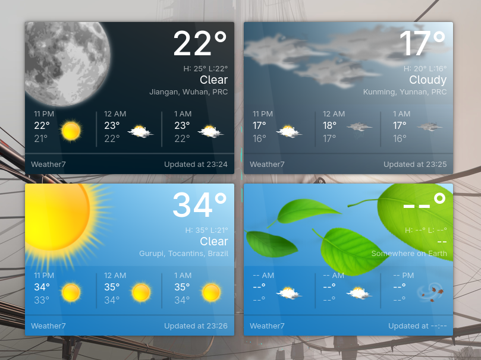

# Plasma Weather 7 

A Frutiger Aero–style weather widget for KDE Plasma 6



## Usage

This weather widget is inspired by [Theldus/Windy](https://github.com/Theldus/windy), and unlike most traditional weather widgets, it does not embed any specific weather API directly within the widget itself. Instead, it delegates the task of fetching weather data to an external script or program specified by the user.

The widget works by invoking the user-defined script and reading JSON output from its standard output (stdout). This JSON data is then parsed and displayed in the widget’s interface. In essence, this widget acts as a graphical frontend for any external weather data source.

By default, the widget calls `curl`, which fetches weather data using the ColorfulClouds API. However, users are free to replace this with any script, in any language, as long as it returns properly formatted JSON.

For more details about the expected JSON format and available APIs, please visit: [Weather | ColorfulClouds](https://docs.caiyunapp.com/weather-api/v2/v2.6/6-weather.html)

## Install

You'll need `kpackagetool6`

```
kpackagetool6 --type "Plasma/Applet" --install package # For installing
kpackagetool6 --type "Plasma/Applet" --upgrade package # For upgrading
```
